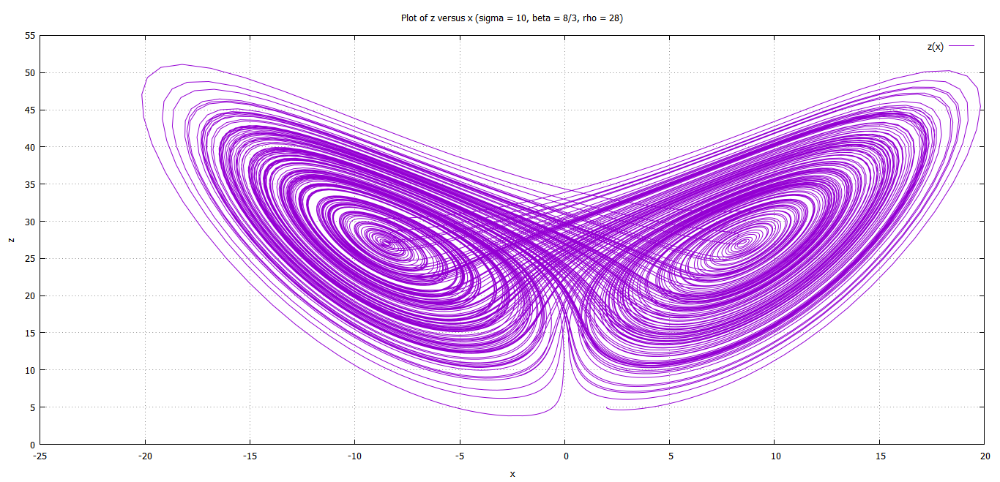
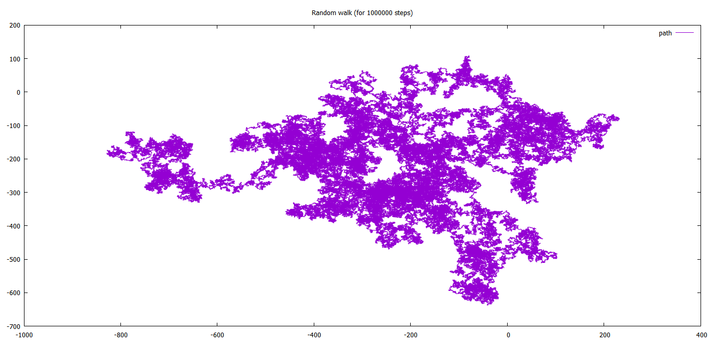

## Gallery

***
A collection of some interesting graphs/plots.

***

1. Lorenz Attractor ([code](https://github.com/mshreyes/Computational-Physics/blob/master/LSA/lorenz2.f95)): 

2. Random walk 2D ([code](https://github.com/mshreyes/Fortran_Programs/blob/master/Random_walk/RW2D.f95)):

