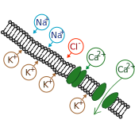

### Equilibrium potential & Resting membrane potential

Animal cells (and plant cells) have presence of various types of ions in different concentrations. For instance, a typical human cell contains potassium (K+), sodium (Na+), calcium (Ca2+) ions and a few other ions in lesser quantities. Regulating the concentrations inside the cells requires energy i.e. concentration gradient is established by means of active transport. A key role in isolating the cytoplasm and a cell's surroundings is done by a semi-permeable membrane, which encloses the cell. 

As the name suggests, a semi-permeable membrane allows only certains substance to pass through it. In a way, it controls the traffic of materials across the cell and its surroundings. It is essentially a phospolipid bilayer with proteins embedded in it. These proteins act as tunnels and have affinity for specific ions. The entry and exit of ions through these tunnel porteins is regulated by conformations of those proteins.

For this lesson, we consider a human nerve cell (or neuron).

A nerve cell consists of following major parts:
- **Cell body**: It contains mitochondria, nucleus, and other cell organelles.
- **Axon**: It is the elongated structure, characteristic to nerve cells, which is responsible for carrying action potentials.
- **Dendrites**: It is the brach-like structure which connects a nerve cell with other cells.

Now consider a small section of the axon. We then see that the cell membrane separates the intercellular matter (cytoplasm) from the extracellular matter. The presence of ions separated y a semi-permeable membrane gives rise to two forces. Namely, diffusion (due to concentration gradient) and electric (due to electric field created by ions).

The concentration of K+ ions is more inside the cell than outside. Thus, the K+ ions flow outside the cell making inside of the cell more negative. If we could zoom in just near the membrane we would see negative charges inside and positive charges outside. Does this remind you of something? Yes, a capacitor (more on that later). 

When you separate two charges, some work is done and this work done for moving one charge away from another is called electric potential. In this case too, the cell membrane has an electric potential. Now, the inside of the cell is negative, outside is positive, so the electric field established will tend to bring positive charges in i.e. *against* the concentration gradient. 

In short, for K+ ion,

| Force | Source | Direction | 
| ------ | ------ | ----- |
| Electric | Electric field | Points inward |
| Diffusion | Concentration gradient |Points outward |

If we observe long enough time, we'd observe that the two forces will eventually attain equilibrium and that inward and outward flow for that particular ion (here K+) will be the same. Thus, the **net flow** of K+ will be zero. The potential when the net flow of K+ ions is zero is called equilibrium potential for K+.

Similarly, other ions too have their very own equilibrium potential. Also called as **Nernst potential** of that ion, it depends on the temperature, concentration of ion and valency of that ion. 

<!-- $$
E_{ion} = \frac{RT}{nF} ln(\frac{[ion_{out}]}{[ion_{in}]}) 
$$ --> 

Above equation represents Nernst potential for a particular ion given the temperature of the system and its concentration (inside and outside the cell). F is Faraday's constant and n is valency of that ion.

Recall that there isn't only on ion (say K+) but many others too (like Ca2+, Na+, etc.). So every ion will have its own equilibrium potential. The potential when the *net* flow in and out through the semi-permeable membrane will be zero, is that cell's resting potential. If the concentration of one ion present is very high then the equilbrium potential of that ion and the resting membrane potential will be almost the same. Resting potential can be calcultaed using either **Chord conductance equation** (Millman's equation) or **Goldman equation**. The former depends of ionic conductivities while the latter depends on relative permablilities of ions.

- Chord conductance equation:
<!-- $$
V_m = \frac{RT}{nF} ln(\frac{g_{K^+} E_{eq,K^+} + g_{Na^+} E_{eq,Na^+} + g_{Cl^-} E_{eq,Cl^-}}{g_{K^+} + g_{Na^+} + g_{Cl^-}})
$$ --> 

- Goldman equation:
<!-- $$
V_m = \frac{RT}{nF} ln(\frac{P_k [K^+]_o + P_{Na} [Na^+]_o + P_{Cl} [Cl^-]_o}{P_k [K^+]_i + P_{Na} [Na^+]_i + P_{Cl} [Cl^-]_i})
$$ --> 

Above equations are valid when K+, Na+ and Cl- are the only ions present. When there are more ions, corresponding terms need to be introduced in the equations. Also, note the dependence on temperature. Naturally, an ion with higher relative permeablility or conductance, compared to other ions, will have greater influence on the resting potential. Another thing to note here is that conductance of a particular ion is influenced by membrane potential i.e. <!-- $ g = g(V_m)$ --> 

*Examples*:

At room temperature, the nernst potential for K+ is -75 mV while the resting membrane potential for neuron is between -60 to -70 mV.

***
